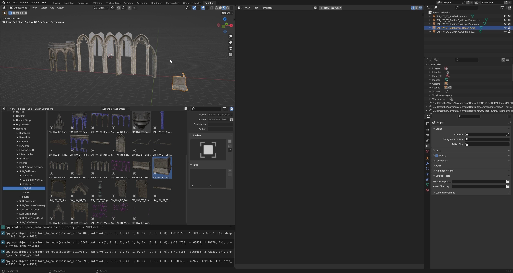

UModel Tools
========================================

Welcome to ``umodel_tools`` documentation. `umodel_tools <https://github.com/skarndev/umodel_tools>`_
is a `Blender <https://blender.org>`_ addon featuring import of `Unreal Engine <https://www.unrealengine.com>`_
games static meshes (stored in-game as .uasset) and (stored in-game as .umap).

Overview
==================

.. toctree::
   :maxdepth: 2

   installation
   configuration
   create_game_profile
   supported_games

Indices and tables
==================

* :ref:`genindex`
* :ref:`modindex`
* :ref:`search`
